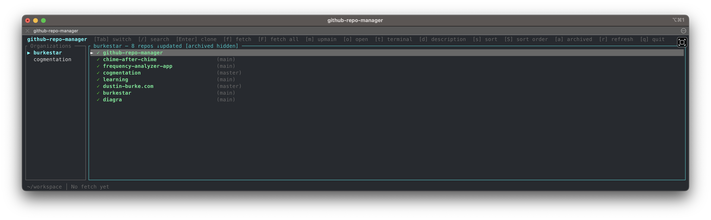

# github-repo-manager

A terminal UI for browsing and managing GitHub repositories across multiple organizations. Navigate repos, clone them into a local workspace, and keep everything up to date automatically.



## Features

- Browse repositories across multiple GitHub organizations
- Fuzzy search repos by name
- See which repos are already checked out locally (with branch and ahead/behind info)
- Clone repos into a configurable workspace (flat or nested directory structure)
- Manual `git fetch` for individual repos or all local repos at once
- Background scheduler that automatically fetches all local repos on a cron schedule
- GitHub API response caching (1 hour TTL) to avoid rate limits

## Quick start

Install:

```bash
cargo install --git <this-repo>
```

> [!NOTE]
> Requires Rust. Installs to `~/.cargo/bin`

Run:

```bash
github-repo-manager
```

> [!IMPORTANT]
> On first run, creates default config at `~/.config/github-repo-manager/config.toml`.
> Create your Github access token, update the config, and re-run the command.

Try:

- `Tab` to navigate between panes for selecting Organizations or Repositories.
- `↓` and `↑` to navigate
- `Enter` to clone the selected repo
- `f` to git fetch the selected repo
- `m` to move to latest code on main branch for selected repo
- `t` to open a terminal for the selected repo
- `o` to open the selected github repo in the browser
- `q` to quit

## Documentation

- **[User Guide](docs/user-guide.md)** — installation, GitHub token setup, configuration, UI overview, key bindings, background fetch scheduler, and caching.
- **[Developer Guide](docs/developer-guide.md)** — prerequisites and building/running from source.
